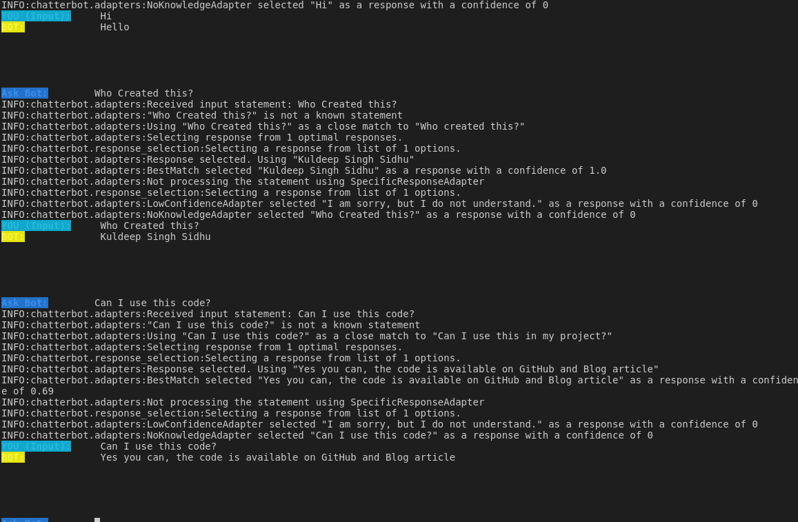

# ChatBot using Chatterbot

### Blog Post: [http://kuldeepsinghsidhu.blogspot.com](http://kuldeepsinghsidhu.blogspot.com)
### Article: https://kuldeepsinghsidhu.blogspot.com/2018/10/creating-chat-bot-using-chatterbot.html

## SetUp

```
virtualenv -p python3 venv --no-site-packages
source venv/bin/activate
pip3 list
pip3 install -r requirements.txt
```

> Using Python 3.5+

## Training

```
python3 train.py
```

### Notes

* You can train this on custom data as well, just pass the folder location in `ChatBot.train(datafolder="./custom", train_corpus=True)` in `train.py`

* Since we are using `trainer='chatterbot.trainers.ChatterBotCorpusTrainer'` check `ChatBot.py`, you need to pass your custom data in the given format. Check `custom/credit.yml` for info

## Running

```
python3 run.py
```

### Notes
* You can turn of logging if you want by commenting `logging.basicConfig(level=logging.INFO)` in `ChatBot.py`

* Threshold is set in `ChatBot.py` at `'threshold': 0.65,`, you can change it.

* In case of response is not found the bot will reply `'default_response': 'I am sorry, but I do not understand.'` set in `ChatBot.py`

* Can create a help response as well in `ChatBot.py`

```
    'input_text': 'Help me!',
    'output_text': 'mail your quey here: singhsidhukuldeep@gmail.com'
```

* The reply is chosen randomly if multiple responsies available: `response_selection_method=get_random_response,` in `ChatBot.py`

## Reply



## CREDITS

>Kuldeep Singh Sidhu

Github: [github/singhsidhukuldeep](https://github.com/singhsidhukuldeep)
`https://github.com/singhsidhukuldeep`

Website: [Kuldeep Singh Sidhu (Website)](http://kuldeepsinghsidhu.com)
`http://kuldeepsinghsidhu.com`

LinkedIn: [Kuldeep Singh Sidhu (LinkedIn)](https://www.linkedin.com/in/singhsidhukuldeep/)
`https://www.linkedin.com/in/singhsidhukuldeep/`
